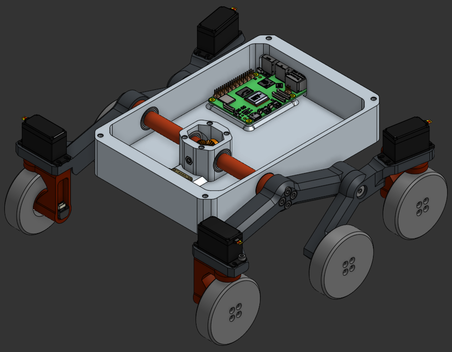
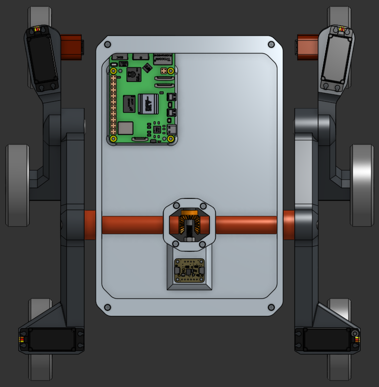
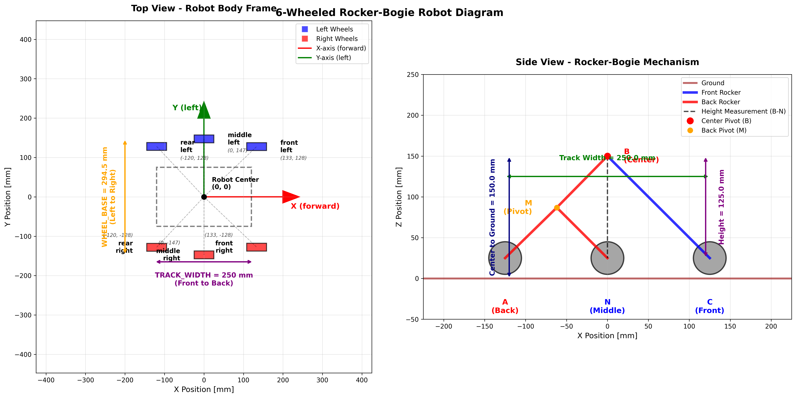

# Perseverance
Mobile Robot resembling NASA's Mars Perseverance Rover. Everything from scratch and open-source including mechanical design, electronics, and software. The end goal of this project is to gain experience with mobile robotics concepts including SLAM, state estimation, and dynamic environment navigation.

## Work In Progress

This project is currently in progress and I'm currently focusing on the drive-base with the following tasks:

- Building a Kalman Filter focusing on the kinematic model of a 6-wheel Mars Rover
- ~~Creating a PPO RL training pipeline for a simplified mobile robot and goal pose navigation~~
- Working on firmware for motor board (RoverFirmware)
- Designing a carrier PCB to connect the MCU with motors, sensors, and power.

---

  
  

  

*This plot was generated with `draw_rocker_bogie.py`*

*A lot of the math expressions aren't rendering correctly and can best be visualized by viewing the markdown render locally in an IDE (VS Code). It's a work in progress to create SVG images for each equation and display them once they are finalized...*

  

*Simulated Teleoperation in pygame with ackerman steering, try it out by running `rover_teleop.py` in `prototyping/`!*

---

# References
- [Path Following using Visual Odometry for a Mars Rover
in High-Slip Environments](https://www-robotics.jpl.nasa.gov/media/documents/helmick04_aeroconf.pdf)
- [Feature-Based Scanning LiDAR-Inertial Odometry Using Factor Graph Optimization](https://ieeexplore.ieee.org/abstract/document/10100875/authors#authors)
- [Autonomous robotics is driving Perseverance rover’s progress on Mars](https://www.science.org/doi/10.1126/scirobotics.adi3099)
- [A Friction-Based Kinematic Model for
Skid-Steer Wheeled Mobile Robots](https://amrl.cs.utexas.edu/papers/icra2019_skid_steer_kinematics.pdf)
- [Kalman Filter Overview](https://www.kalmanfilter.net/default.aspx)
- [Ghost IV — Sensor Fusion: Encoders + IMU](https://medium.com/hackernoon/ghost-iv-sensor-fusion-encoders-imu-c099dd40a7b)
- [Design of Rocker-Bogie Mechanism](https://ijisrt.com/wp-content/uploads/2017/05/Design-of-Rocker-Bogie-Mechanism-1.pdf)
- [The Challenges of Designing the Rocker-Bogie Suspension
for the Mars Exploration Rover](https://esmats.eu/amspapers/pastpapers/pdfs/2004/harrington.pdf)
- [Design and Fabrication of six wheels Rocker Bogie Mechanisms](https://sist.sathyabama.ac.in/sist_naac/aqar_2022_2023/documents/1.3.4/mechatronics_batch%20no.21.pdf)
- [Understanding and Making Rocker-Bogie System](https://docs.sunfounder.com/projects/galaxy-rvr/en/latest/lesson2_rocker_bogie.html
)
