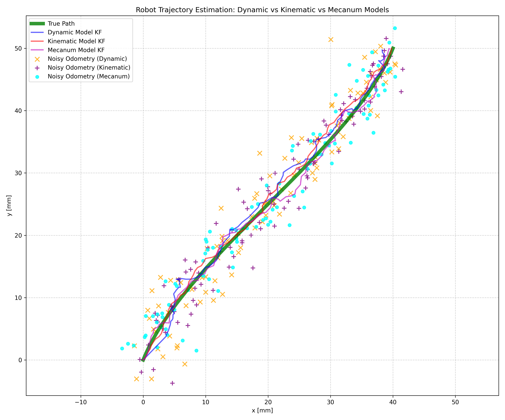
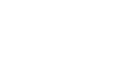

# Perseverance
Mobile Robot resembling NASA's Mars Perseverance Rover. Everything from scratch

# Kalman Filtering for Rover State Estimation
Approximating the robot as a diff-drive robot makes it easier to compute the state transition matrix and derive the system dynamics/kinematics. A kinematic model for a mecanum wheeled drive was also implemented.

<div style="display: flex; justify-content: space-between; align-items: flex-start; gap: 8px;">
  
  
  
</div>

```txt
===========================================================================
KALMAN FILTER PERFORMANCE COMPARISON
===========================================================================
State           Dynamic RMSE    Kinematic RMSE  Mecanum RMSE    Best Model
---------------------------------------------------------------------------
x [mm]          0.811           0.198           0.311           Kinematic
y [mm]          0.785           0.257           0.482           Kinematic
theta [rad]     0.069           0.050           0.057           Kinematic
vx [mm/s]       1.216           0.246           0.378           Kinematic
vy [mm/s]       0.475           0.224           0.367           Kinematic
omega [rad/s]   0.170           0.035           0.049           Kinematic
---------------------------------------------------------------------------
Overall         0.588           0.168           0.274           Kinematic
```

## Robot State & Dynamics
The goal of the prediction step in a Kalman filter is to model how the robot's state evolves over a time step $\Delta t$. This model is based on control inputs, which are the commands we send to the robot. For a differential drive robot, these inputs are the left and right wheel velocities. The robot's state vector $X$ and control vector $U$ can be expressed as:

$$X = \left[x, y, \theta, v_x, v_y\right]$$

$$U = \left[v_{left}, v_{right}\right]$$

In order to derive the dynamics and eventually the state transition function, we need to identify how left and right velocities contribute to each entry in the state vector (at each timestep $\Delta t$).

$$V = \frac{v_{left} + v_{right}}{2}$$

$$\omega = \frac{v_{right} - v_{left}}{L_{base}} $$

The function that describes the state's evolution is the **process model:** $f\left(X_{prev}, U, \Delta t\right) \to X_{next}$

$$\begin{bmatrix}x \\ y \\ \theta \\ v_{x} \\ v_{y} \\ \omega \end{bmatrix} = \begin{bmatrix}x_{prev} + V \cos\theta_{prev} \Delta t \\ y_{prev} + V\sin\theta _{prev}\Delta t \\ \theta_{prev} + \omega \Delta t \\ V a_x \Delta t \\ V a_y \Delta t \\ \omega\end{bmatrix}$$

<div style="width: 100%; display: flex; justify-content: center;">
  
</div>

Notice that the new velocities, $(v_x, v_y)$ are determined by the control input $V$ and the *new* orientation $\theta_{new}$. This is a *non-linear* process model because of the use of trigonometric functions on the state variable $\theta$.

### Tuning the Process Noise Covariance $(Q)$

### State Transition Matrix (Jacobian)
Because the process model is non-linear, we must use an Extended Kalman Filter (EKF). This requires a state transition matrix F that is the Jacobian of the process model—a matrix of partial derivatives of the new state with respect to the old state.

$$
F = \frac{\delta f(X,U)}{\delta X} =\begin{bmatrix}\frac{\delta x_{new}}{\delta x} & \frac{\delta x_{new}}{\delta y} & \frac{\delta x_{new}}{\delta \theta} & \frac{\delta x_{new}}{\delta v_x} & \frac{\delta x_{new}}{\delta v_y}\\ \frac{\delta y_{new}}{\delta x} & \frac{\delta y_{new}}{\delta y} & \frac{\delta y_{new}}{\delta \theta} & \frac{\delta y_{new}}{\delta v_x} & \frac{\delta y_{new}}{\delta v_y}\\ \frac{\delta \theta_{new}}{\delta x} & \frac{\delta \theta_{new}}{\delta y} & \frac{\delta \theta_{new}}{\delta \theta} & \frac{\delta \theta_{new}}{\delta v_x} & \frac{\delta \theta_{new}}{\delta v_y}\\ \frac{\delta v_{x_{new}}}{\delta x} & \frac{\delta v_{x_{new}}}{\delta y} & \frac{\delta v_{x_{new}}}{\delta \theta} & \frac{v_{x_{new}}}{\delta v_x} & \frac{v_{y_{new}}}{\delta v_y} \\ \frac{\delta v_{y_{new}}}{\delta x} & \frac{\delta v_{y_{new}}}{\delta y} & \frac{\delta v_{y_{new}}}{\delta \theta} & \frac{v_{y_{new}}}{\delta v_x} & \frac{v_{y_{new}}}{\delta v_y}\end{bmatrix} = \begin{bmatrix} 1 & 0 & -V\sin(\theta)\Delta t & 0 & 0 & 0 \\ 0 & 1 & V\cos(\theta)\Delta t & 0 & 0 & 0 \\ 0 & 0 & 1 & 0 & 0 & 0 \\ 0 & 0 & -V\sin(\theta_{new}) & 0 & 0 & 0 \\ 0 & 0 & V\cos(\theta_{new}) & 0 & 0 & 0 \\ 0 & 0 & 0 & 0 & 0 & 0 \end{bmatrix}
$$

Note that the new velocities and angular rate do not depend on the previous velocities or angular rate, making their corresponding derivatives zero.

## Sensor Updates
The correction step of the filter uses sensor measurements to refine the predicted state. For each sensor, we need a measurement model $H(X)$ that computes the expected measurement from a given state vector.

### IMU Sensor
The IMU measures the angular rate around the Z-axs $\omega$ as well as the linear acceleration $a_x, a_y$.

$$z_{imu} = \left[\omega, a_x, a_y\right]$$

The measurement model only needs to use the angular velocity

$$H_{imu}(X) = \left[0, 0, 0, 0, 0, 1\right]$$

### Odometry
Odometry uses wheel encoders coupled with knowledge about the robot's physical layout to obtain an estimate of the robot's pose:

$$z_{odom} = \left[x_{odom}, y_{odom}, \theta_{odom}\right]$$

The measurement model selects the pose elements from the state:

$$H_{odom}(X) = \left[1, 1, 1, 0, 0, 0\right]$$

### Tuning Measurement Noise Covariance $(R)$
Collect data with the robot sitting absolutely still for a specified length of time and calculate the variance of the data set for each sensor's respective values in the measurement model.

$$R \approx \sigma^2 = \frac{1}{N}\sum_i^N\left(x_i - \mu\right)^2$$

The datasheet for each sensor could prove to be useful if they've documented the sensor's noise density and/or standard deviation.

## Prediction using Control Inputs

### IMU Acceleration as Control Input (System Dynamics Model)
In this model, we treat the IMU's acceleration readings as our control input, describing the forces acting on the robot.

- Prediction Model: We use a physics-based constant acceleration model. This system is linear.

$$X_{new}​=F X_{prev}​+B U_{imu​}$$

- Control Vector ($U_{imu​}$): Global-frame accelerations derived from IMU readings.

$$U_{imu​}=\begin{bmatrix}a_x\\ a_y\end{bmatrix}_{\text{global​}}$$

- State Transition ($F$):

$$F = \begin{bmatrix} 1 & 0 & 0 & \Delta t & 0 & 0 \\ 0 & 1 & 0 & 0 & \Delta t & 0 \\ 0 & 0 & 1 & 0 & 0 & \Delta t \\ 0 & 0 & 0 & 1 & 0 & 0 \\ 0 & 0 & 0 & 0 & 1 & 0 \\ 0 & 0 & 0 & 0 & 0 & 1 \end{bmatrix}$$

- Control Input Matrix ($B$):

$$B = \frac{\delta X}{U_{imu}} = \begin{bmatrix}\frac{\delta X}{a_x} & \frac{\delta X}{a_y}\end{bmatrix} = \begin{bmatrix}0.5\Delta t^2 & 0 \\ 0 & 0.5\Delta t^2\\ 0 & 0 \\ \Delta t & 0 \\ 0 & \Delta t \\ 0 & 0\end{bmatrix}$$

### Wheel Velocities as Control Input (System Kinematics Model)
This is the more common approach for differential drive robots, where we use the commanded wheel velocities to predict motion.

- Prediction Model: We use the non-linear kinematic model defined in the first section. This requires an EKF.

$$X_{new} = f(X_{prev}, U_{wheels})$$

- Control Vector ($U_{wheels}$):

$$ U_{wheels} = \begin{bmatrix}V\\ \omega \end{bmatrix}$$

- State transition matrix ($F$) *as defined earlier*:

$$F = \begin{bmatrix} 1 & 0 & -V\sin(\theta)\Delta t & 0 & 0 & 0 \\ 0 & 1 & V\cos(\theta)\Delta t & 0 & 0 & 0 \\ 0 & 0 & 1 & 0 & 0 & 0 \\ 0 & 0 & -V\sin(\theta_{new}) & 0 & 0 & 0 \\ 0 & 0 & V\cos(\theta_{new}) & 0 & 0 & 0 \\ 0 & 0 & 0 & 0 & 0 & 0 \end{bmatrix}$$
