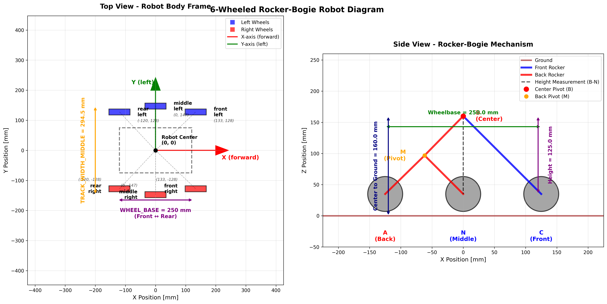
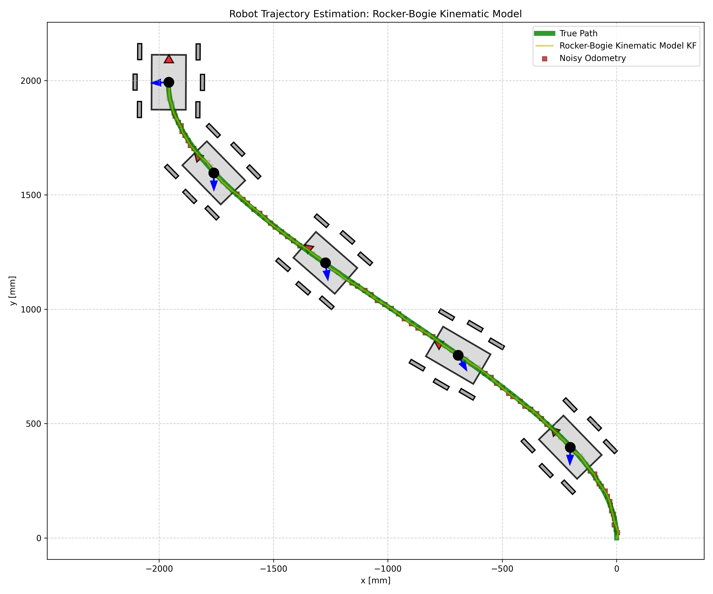
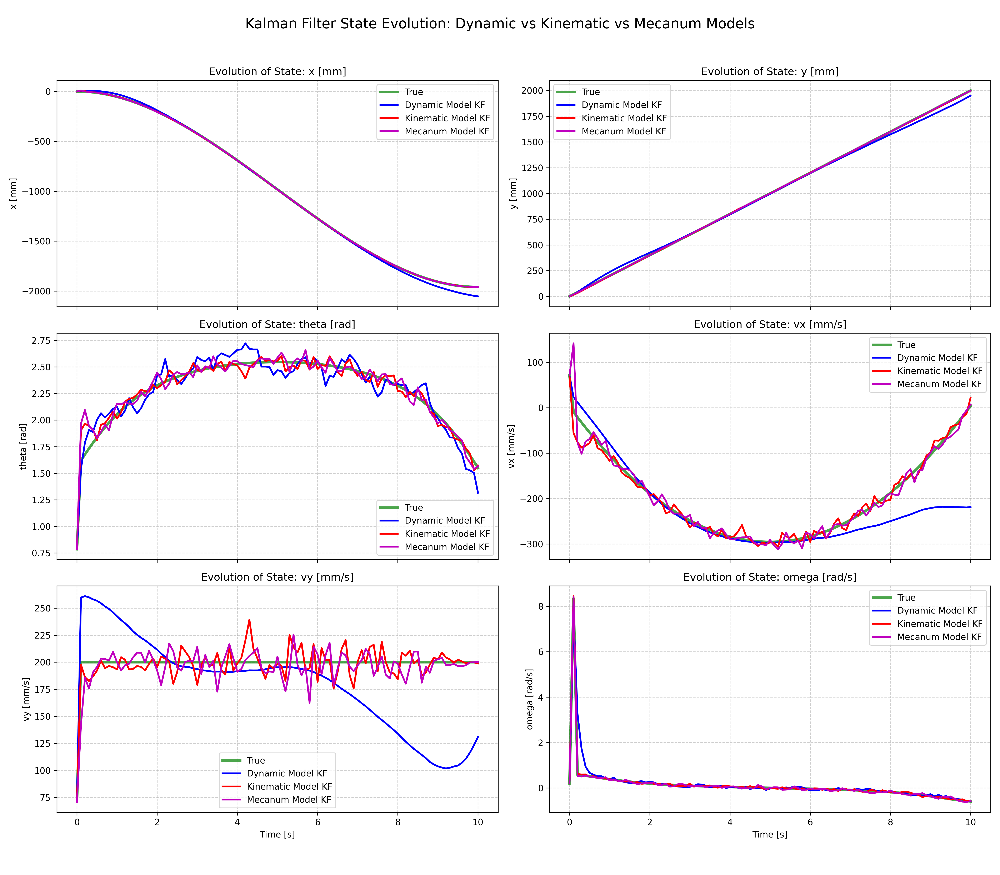
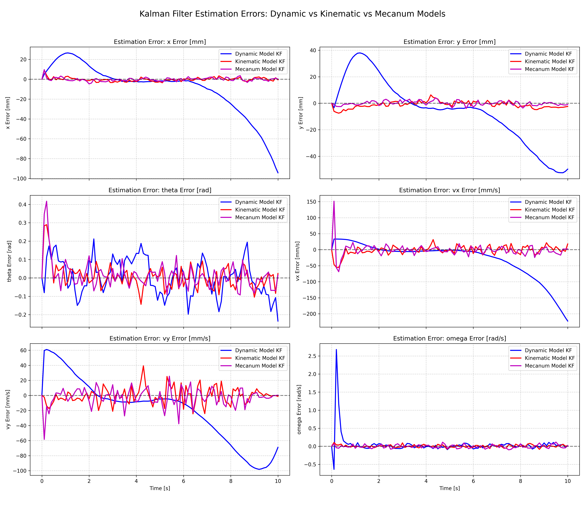
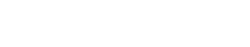

# Perseverance
Mobile Robot resembling NASA's Mars Perseverance Rover. Everything from scratch and open-source including mechanical design, electronics, and software. The end goal of this project is to gain experience with mobile robotics concepts including SLAM, state estimation, and dynamic environment navigation.


## Work In Progress
[](https://wakatime.com/badge/user/b25c3469-3f3c-4aff-90ef-5723a788454c/project/5c2a6026-001a-4a48-9ca0-751737dcbed2)

This project is currently in progress and I'm currently focusing on the drive-base with the following tasks:

- Building a Kalman Filter focusing on the kinematic model of a 6-wheel Mars Rover
  - I have also implemented kinematic models for diff-drive, mecanum, and skid-steering for the educational value.
- Creating a data-driven layout for the physical robot, focusing on the important features such as: rocker-bogie assembly, rocker-bogie differential system, and the 4 independently steered wheels.
- Architecting the ROS2 package to easily fit sensors and modularize the filter.
- Creating a PPO RL training pipeline for a simplified mobile robot and goal pose navigation
- Implementing simulated sensors (IMU, Lidar) for testing state estimation

---

<div style="display: flex; justify-content: center; align-items: flex-start; gap: 12px;">
  
  
</div>

<div style="display: flex; justify-content: center; align-items: center; width: 80%;">
  
</div>

*This plot was generated with `draw_rocker_bogie.py`*

*A lot of the math expressions aren't rendering correctly and can best be visualized by viewing the markdown render locally in an IDE (VS Code). It's a work in progress to create SVG images for each equation and display them once they are finalized...*

---

# Extended Kalman Filter for Rover State Estimation
Approximating the robot as a diff-drive robot makes it easier to compute the state transition matrix and derive the system dynamics/kinematics. Kinematic models for mecanum wheeled drive and rocker bogie suspension system are more complex, but better represent the robot's motion, and I've implemented motion models for all 3.

*Note: Each motion model still needs to be tested rigorously*

<div style="display: flex; justify-content: space-between; align-items: flex-start; gap: 8px;">
  
  
  
</div>

## Prediction Models

### Diff-drive Kinematic Model
The control input for the diff-drive robot is very simple both wheel velocities:

$$U_{\text{diff}} = \left[v_{left}, v_{right}\right]$$

The function that describes the state's evolution is the **process model:** $f\left(X_{prev}, U, \Delta t\right) \to X_{next}$ which correlates a previous state to the next state with some timestep $\Delta t$.

<!-- $$\begin{bmatrix}x \\ y \\ \theta \\ v_{x} \\ v_{y} \\ \omega \end{bmatrix} = \begin{bmatrix}x_{prev} + V \cos\theta_{prev} \Delta t \\ y_{prev} + V\sin\theta _{prev}\Delta t \\ \theta_{prev} + \omega \Delta t \\ V a_x \Delta t \\ V a_y \Delta t \\ \omega\end{bmatrix}$$ -->

<div style="display: flex; justify-content: center; align-items: center; width: 100%; background: black; padding: 10px; border-radius: 8px;">
  
</div>

The state transition matrix $F$ (also known as the Jacobian of the process model) describes how a new state relates to the old state as a matrix of partial derivatives.

<!-- $$F = \begin{bmatrix} 1 & 0 & -V\sin(\theta)\Delta t & 0 & 0 & 0 \\ 0 & 1 & V\cos(\theta)\Delta t & 0 & 0 & 0 \\ 0 & 0 & 1 & 0 & 0 & 0 \\ 0 & 0 & -V\sin(\theta_{new}) & 0 & 0 & 0 \\ 0 & 0 & V\cos(\theta_{new}) & 0 & 0 & 0 \\ 0 & 0 & 0 & 0 & 0 & 0 \end{bmatrix}$$ -->

<div style="display: flex; justify-content: center; align-items: center; width: 100%; background: black; padding: 10px; border-radius: 8px;">
  
</div>


### Mecanum Kinematic Model
The mecanum wheel robot is omni-directional and each wheel contributes to the robot's overall velocity vector:

$$U_{\text{mecanum}} = \left[v_{1}, v_{2}, v_{3}, v_{4}\right]$$

Wheel angular speeds (ordered: front-left, front-right, rear-left, rear-right) map to body-frame velocities via a linear transform (forward kinematics):

$$\begin{bmatrix} v_x \\ v_y \\ \omega \end{bmatrix} = \frac{R}{4}\begin{bmatrix} 1 & 1 & 1 & 1 \\ -1 & 1 & -1 & 1 \\ -\tfrac{1}{L+W} & \tfrac{1}{L+W} & -\tfrac{1}{L+W} & \tfrac{1}{L+W} \end{bmatrix}\begin{bmatrix} v_1 \\ v_2 \\ v_3 \\ v_4 \end{bmatrix}$$

Where:
* $R$ is wheel radius
* $W_b$ is the Wheel base (longitudinal length)
* $T$ is the Track width (lateral length)
* $L = \tfrac{W_b}{2}$
* $W = \tfrac{T}{2}$

Body-frame velocities are converted to global-frame motion using the heading $\theta$:

$$\begin{aligned}
\dot{x} &= v_x\cos\theta - v_y\sin\theta\\
\dot{y} &= v_x\sin\theta + v_y\cos\theta\\
\dot{\theta} &= \omega
\end{aligned}$$

With the extended state vector (including velocities)
$$X = [x,\ y,\ \theta,\ v_x,\ v_y,\ \omega]^T$$
and treating wheel speeds as control inputs, the (non-linear) discrete process model over $\Delta t$ is:

$$\begin{bmatrix} x_{k+1} \\ y_{k+1} \\ \theta_{k+1} \\ v_{x,k+1} \\ v_{y,k+1} \\ \omega_{k+1} \end{bmatrix} = \begin{bmatrix}
 x_k + (v_{x,k}\cos\theta_k - v_{y,k}\sin\theta_k)\Delta t \\
 y_k + (v_{x,k}\sin\theta_k + v_{y,k}\cos\theta_k)\Delta t \\ \theta_k + \omega_k \Delta t \\
 f_{v_x}(U_k) \\
 f_{v_y}(U_k) \\
 f_{\omega}(U_k)
\end{bmatrix}$$

Where $f_{v_x}, f_{v_y}, f_{\omega}$ are the linear mappings from wheel speeds (matrix above). Because $v_x, v_y, \omega$ depend only on current control inputs, their partial derivatives w.r.t previous velocities are zero in the Jacobian.

Jacobian (state transition matrix) $F = \tfrac{\partial f}{\partial X}$ evaluated at $(X_k,U_k)$:

$$F = \begin{bmatrix}
1 & 0 & -(v_x\sin\theta_k + v_y\cos\theta_k)\Delta t & \cos\theta_k\Delta t & -\sin\theta_k\Delta t & 0 \\
0 & 1 & \ (v_x\cos\theta_k - v_y\sin\theta_k)\Delta t & \sin\theta_k\Delta t & \cos\theta_k\Delta t & 0 \\
0 & 0 & 1 & 0 & 0 & \Delta t \\
0 & 0 & 0 & 0 & 0 & 0 \\
0 & 0 & 0 & 0 & 0 & 0 \\
0 & 0 & 0 & 0 & 0 & 0
\end{bmatrix}$$

The lower rows are zero because the new body velocities are set directly from the control (wheel speeds) rather than previous velocities.

### Rocker-Bogie Suspension Kinematic Model
The rocker-bogie suspension has 6 powered wheels, 4 of which are able to rotate independently for ackerman-style steering. The control vector includes all wheel velocities and the 4 (outer) wheel steering angles:

$$U_{\text{rocker-bogie}} = \left[v_1, v_2, v_3, v_4, v_5, v_6, \theta_1, \theta_2, \theta_3, \theta_4\right]$$

Each wheel $i$ at position $(x_i,y_i)$ (in the body frame) with steering angle $\delta_i$ and drive speed $v_i$ provides two constraints on body-frame velocities $(v_{bx}, v_{by}, \omega_b)$:

$$\begin{aligned}
v_{bx} - \omega_b y_i &= v_i \cos\delta_i \\
v_{by} + \omega_b x_i &= v_i \sin\delta_i
\end{aligned}$$

Stacking all 6 wheels yields a linear system $A\,\mathbf{b} = \mathbf{m}$ with $A \in \mathbb{R}^{12\times 3}$, unknown $\mathbf{b} = [v_{bx}, v_{by}, \omega_b]^T$, and measurement vector $\mathbf{m}$ composed of $v_i\cos\delta_i, v_i\sin\delta_i$ pairs. The least-squares solution:

$$\begin{bmatrix} v_{bx} \\ v_{by} \\ \omega_b \end{bmatrix} = (A^{T}A)^{-1}A^{T} \mathbf{m} = A^{\dagger}\,\mathbf{m}$$

Body velocities are transformed to global frame and integrated:

$$\begin{aligned}
\dot{x} &= v_{bx}\cos\theta - v_{by}\sin\theta\\
\dot{y} &= v_{bx}\sin\theta + v_{by}\cos\theta\\
\dot{\theta} &= \omega_b
\end{aligned}$$

Discrete process model with state $X = [x, y, \theta, v_x, v_y, \omega]^T$ (using global-frame velocities $v_x, v_y$):

$$\begin{bmatrix} x_{k+1} \\ y_{k+1} \\ \theta_{k+1} \\ v_{x,k+1} \\ v_{y,k+1} \\ \omega_{k+1} \end{bmatrix} = \begin{bmatrix}
 x_k + v_{x,k}\Delta t \\
 y_k + v_{y,k}\Delta t \\
 \theta_k + \omega_k \Delta t \\
 v_{x}^{(b)\to g}(U_k) \\
 v_{y}^{(b)\to g}(U_k) \\
 \omega_b(U_k)
\end{bmatrix}$$

Because $v_x, v_y, \omega$ are fully determined by wheel inputs each step, their derivatives w.r.t prior velocities are zero in the Jacobian (similar sparsity to mecanum). Non-linear dependence enters only through the heading rotation applied to $(v_{bx}, v_{by})$.

<!-- $$
F = \frac{\delta f(X,U)}{\delta X} =\begin{bmatrix}\frac{\delta x_{new}}{\delta x} & \frac{\delta x_{new}}{\delta y} & \frac{\delta x_{new}}{\delta \theta} & \frac{\delta x_{new}}{\delta v_x} & \frac{\delta x_{new}}{\delta v_y}\\ \frac{\delta y_{new}}{\delta x} & \frac{\delta y_{new}}{\delta y} & \frac{\delta y_{new}}{\delta \theta} & \frac{\delta y_{new}}{\delta v_x} & \frac{\delta y_{new}}{\delta v_y}\\ \frac{\delta \theta_{new}}{\delta x} & \frac{\delta \theta_{new}}{\delta y} & \frac{\delta \theta_{new}}{\delta \theta} & \frac{\delta \theta_{new}}{\delta v_x} & \frac{\delta \theta_{new}}{\delta v_y}\\ \frac{\delta v_{x_{new}}}{\delta x} & \frac{\delta v_{x_{new}}}{\delta y} & \frac{\delta v_{x_{new}}}{\delta \theta} & \frac{v_{x_{new}}}{\delta v_x} & \frac{v_{y_{new}}}{\delta v_y} \\ \frac{\delta v_{y_{new}}}{\delta x} & \frac{\delta v_{y_{new}}}{\delta y} & \frac{\delta v_{y_{new}}}{\delta \theta} & \frac{v_{y_{new}}}{\delta v_x} & \frac{v_{y_{new}}}{\delta v_y}\end{bmatrix} = \begin{bmatrix} 1 & 0 & -V\sin(\theta)\Delta t & 0 & 0 & 0 \\ 0 & 1 & V\cos(\theta)\Delta t & 0 & 0 & 0 \\ 0 & 0 & 1 & 0 & 0 & 0 \\ 0 & 0 & -V\sin(\theta_{new}) & 0 & 0 & 0 \\ 0 & 0 & V\cos(\theta_{new}) & 0 & 0 & 0 \\ 0 & 0 & 0 & 0 & 0 & 0 \end{bmatrix}
$$ -->

<div style="display: flex; justify-content: center; align-items: center; width: 100%; background: black; padding: 10px; border-radius: 8px;">
  
</div>


Note that the new velocities and angular rate do not depend on the previous velocities or angular rate, making their corresponding derivatives zero. The new velocities, $(v_x, v_y)$ are determined by the control input $V$ and the *new* orientation $\theta_{new}$. This is a *non-linear* process model because of the use of trigonometric functions on the state variable $\theta$.

### Mobile Robot Dynamic (Acceleration-Based) Model
This model treats measured linear accelerations (e.g., IMU) as control inputs producing a constant-acceleration (CA) motion assumption over each small interval $\Delta t$.

State (extended to include velocities & yaw rate):
$$X = [x, y, \theta, v_x, v_y, \omega]^T$$

Control Vector (global-frame linear accelerations):
$$U_{\text{imu}} = [a_x, a_y]^T$$

Continuous dynamics (assuming measured $\omega$ is incorporated separately via a gyro measurement update):
$$\begin{aligned}
\dot{x} &= v_x & \dot{v}_x &= a_x \\
\dot{y} &= v_y & \dot{v}_y &= a_y \\
\dot{\theta} &= \omega & \dot{\omega} &= 0
\end{aligned}$$

Discretized (first-order) process model:
$$\begin{bmatrix} x_{k+1} \\ y_{k+1} \\ \theta_{k+1} \\ v_{x,k+1} \\ v_{y,k+1} \\ \omega_{k+1} \end{bmatrix} = \begin{bmatrix}
 x_k + v_{x,k}\Delta t + \tfrac{1}{2} a_{x,k}\Delta t^2 \\
 y_k + v_{y,k}\Delta t + \tfrac{1}{2} a_{y,k}\Delta t^2 \\
 	heta_k + \omega_k \Delta t \\
 v_{x,k} + a_{x,k}\Delta t \\
 v_{y,k} + a_{y,k}\Delta t \\
 \omega_k
\end{bmatrix}$$

This can be written in linear form $X_{k+1} = F X_k + B U_k$ where:

$$F = \begin{bmatrix}
1 & 0 & 0 & \Delta t & 0 & 0 \\
0 & 1 & 0 & 0 & \Delta t & 0 \\
0 & 0 & 1 & 0 & 0 & \Delta t \\
0 & 0 & 0 & 1 & 0 & 0 \\
0 & 0 & 0 & 0 & 1 & 0 \\
0 & 0 & 0 & 0 & 0 & 1
\end{bmatrix}, \quad
B = \begin{bmatrix}
	\frac{1}{2}\Delta t^2 & 0 \\
0 & \frac{1}{2}\Delta t^2 \\
0 & 0 \\
\Delta t & 0 \\
0 & \Delta t \\
0 & 0
\end{bmatrix}$$

Yaw rate $\omega$ is modeled as constant between corrections (process noise captures drift). If desired, a third acceleration/torque input could be added to extend $B$ for angular acceleration.

## Robot State & Covariance
The goal of the prediction step in a Kalman filter is to use the prediction model to calculate how the robot's state evolves over a time step $\Delta t$. This model is based on control inputs, which are the commands we send to the robot. Any given state may have some error, and it's important to capture this uncertainty in our state representation with what we call a state covariance matrix, typically denoted as $P$. The state covariance matrix describes the uncertainty of each state variable and how they are correlated with each other, and is usually a diagonal matrix, unless there are state variables that are correlated with each other.

$$X = \left[x, y, \theta, v_x, v_y, \omega\right]$$

$$P = \begin{bmatrix}
\sigma_x^2 & 0 & 0 & 0 & 0 & 0 \\
0 & \sigma_y^2 & 0 & 0 & 0 & 0 \\
0 & 0 & \sigma_\theta^2 & 0 & 0 & 0 \\
0 & 0 & 0 & \sigma_{v_x}^2 & 0 & 0 \\
0 & 0 & 0 & 0 & \sigma_{v_y}^2 & 0 \\
0 & 0 & 0 & 0 & 0 & \sigma_\omega^2
\end{bmatrix}$$

### Tuning the Initial State Covariance $(P)$
The initial state covariance $P$ should be the variance of the initial state values. Typically the initial state is all zeros and the covariances can be small.

### Tuning the Process Noise Covariance $(Q)$
$Q$ represents how much confidence we have in our prediction model. Typically kinematic models are pretty robust, for diff-drive robots at least, but can accumulate some inaccuracy for skid-steering and mecanum wheeled drive bases. Smaller values trust the prediction model more, while larger values alot more trust to the sensor measurements that are used to correct the robot's state. This should be tuned last after tuning the initial covariance $P$, and the measurement covariances $R$ (discussed below).

### Updating Covariance Matrices
During each **prediction step**, we learn more about the system's dynamics and need to update our state-covariance matrix to reflect this new knowledge:

$$ P_{k+1} = F P_k F^T + Q $$

During the **update step**, we also need to update the state covariance matrix to reflect the new information gained from the sensor measurements. We do this with the kalman gain $K$, the innovation covariance $S$ and the measurement noise covariance $R$:

$$S = H P_{k} H^T + R$$

$$K = P_{k} H^T S^{-1}$$

$$P_{k+1} = (I - K H) P_{k}$$

## Sensor Fusion Updates
The correction step of the filter uses sensor measurements to refine the predicted state. For each sensor, we need a measurement model $H(X)$ that computes the expected measurement from a given state vector.

### IMU Sensor
The IMU measures the angular rate around the Z-axis $\omega$ as well as the linear acceleration $a_x, a_y$.

$$z_{imu} = \left[\omega, a_x, a_y\right]$$

The measurement model only needs to use the angular velocity

$$H_{imu}(X) = \left[0, 0, 0, 0, 0, 1\right]$$

### Odometry
Odometry uses wheel encoders coupled with knowledge about the robot's physical layout to obtain an estimate of the robot's pose:

$$z_{odom} = \left[x_{odom}, y_{odom}, \theta_{odom}\right]$$

The measurement model selects the pose elements from the state:

$$H_{odom}(X) = \left[1, 1, 1, 0, 0, 0\right]$$

### Tuning Measurement Noise Covariance $(R)$
Collect data with the robot sitting absolutely still for a specified length of time and calculate the variance of the data set for each sensor's respective values in the measurement model.

$$R \approx \sigma^2 = \frac{1}{N}\sum_i^N\left(x_i - \mu\right)^2$$

The datasheet for each sensor could prove to be useful if they've documented the sensor's noise density and/or standard deviation.

## State Estimation Pipeline
Now that we're equipped with jargon and the individual components of the EKF, we can outline the state estimation pipeline with some pseudocode:

```python
# 1. Initialize state and covariance
X = np.zeros((6, 1)) # [x, y, theta, v_x, v_y, omega]
P = np.eye(6) * 1e-3 # State Covariance Matrix
Q = np.eye(6) * 1e-3 # Process Noise Covariance Matrix
prev_estimate_time = 0 # Timestamp for the previous update

# Loop through prediction and update step
# This typically happens at a fixed time interval e.g. every 100ms or 10Hz
while True:
  # Calculate timestep between estimations
  current_time = now()
  dt = current_time - prev_estimate_time
  if (dt <= 0):
    continue;

  # 2. Prediction Step
  # 2.1 Predict the next state using the process model
  X_new = process_model(X, dt)

  # 2.2 Calculate the Jacobian F
  F = calculate_jacobian(X, dt)

  # 2.3. Update the state covariance
  P = F @ P @ F.T + Q

  # 3. Update Step
  for [z, H, R] in sensor_readings:
    # z is the measurement vector from the sensor
    # H is the measurement model matrix for the sensor
    # R is the measurement noise covariance for this sensor

    # 3.1 Calculate the innovation
    y = z - H @ X_new

    # 3.2 Calculate the innovation covariance [S]
    S = H @ P @ H.T + R

    # 3.3 Calculate the kalman gain [K]
    K = P @ H.T @ np.linalg.inv(S)

    # 3.4 Update the state estimate
    X_new = X_new + K @ y

    # 3.5 Update the state covariance
    P = (np.eye(6) - K @ H) @ P

  # Update estimate timestamp before next loop execution
  prev_estimate_timestamp = current_time
```

# References

- [Path Following using Visual Odometry for a Mars Rover
in High-Slip Environments](https://www-robotics.jpl.nasa.gov/media/documents/helmick04_aeroconf.pdf)
- [Feature-Based Scanning LiDAR-Inertial Odometry Using Factor Graph Optimization](https://ieeexplore.ieee.org/abstract/document/10100875/authors#authors)
- [Autonomous robotics is driving Perseverance rover’s progress on Mars](https://www.science.org/doi/10.1126/scirobotics.adi3099)
- [A Friction-Based Kinematic Model for
Skid-Steer Wheeled Mobile Robots](https://amrl.cs.utexas.edu/papers/icra2019_skid_steer_kinematics.pdf)
- [Kalman Filter Overview](https://www.kalmanfilter.net/default.aspx)
- [Ghost IV — Sensor Fusion: Encoders + IMU](https://medium.com/hackernoon/ghost-iv-sensor-fusion-encoders-imu-c099dd40a7b)
- [Design of Rocker-Bogie Mechanism](https://ijisrt.com/wp-content/uploads/2017/05/Design-of-Rocker-Bogie-Mechanism-1.pdf)
- [The Challenges of Designing the Rocker-Bogie Suspension
for the Mars Exploration Rover](https://esmats.eu/amspapers/pastpapers/pdfs/2004/harrington.pdf)
- [Design and Fabrication of six wheels Rocker Bogie Mechanisms](https://sist.sathyabama.ac.in/sist_naac/aqar_2022_2023/documents/1.3.4/mechatronics_batch%20no.21.pdf)
- [Understanding and Making Rocker-Bogie System](https://docs.sunfounder.com/projects/galaxy-rvr/en/latest/lesson2_rocker_bogie.html
)
